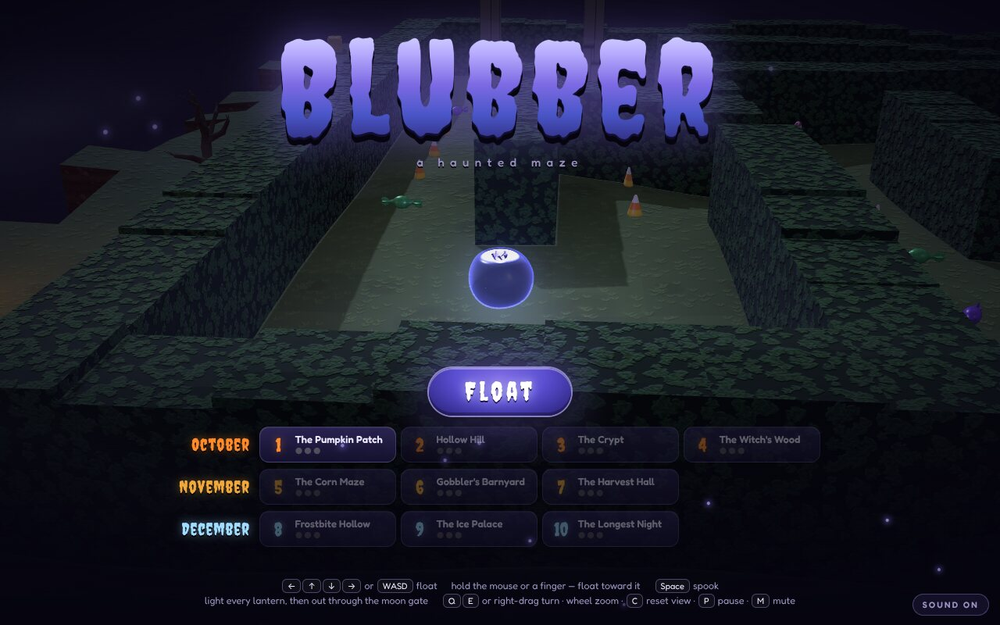
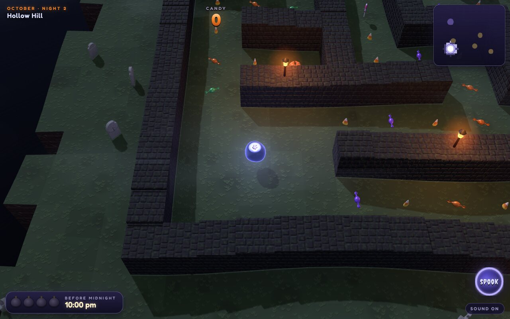
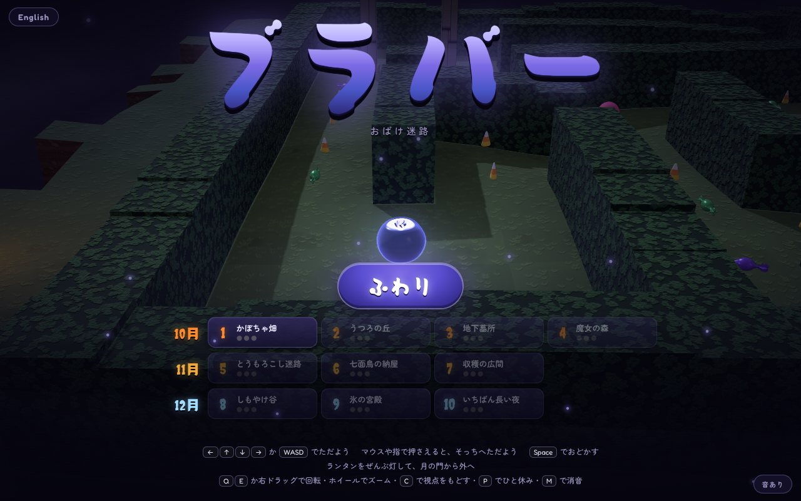
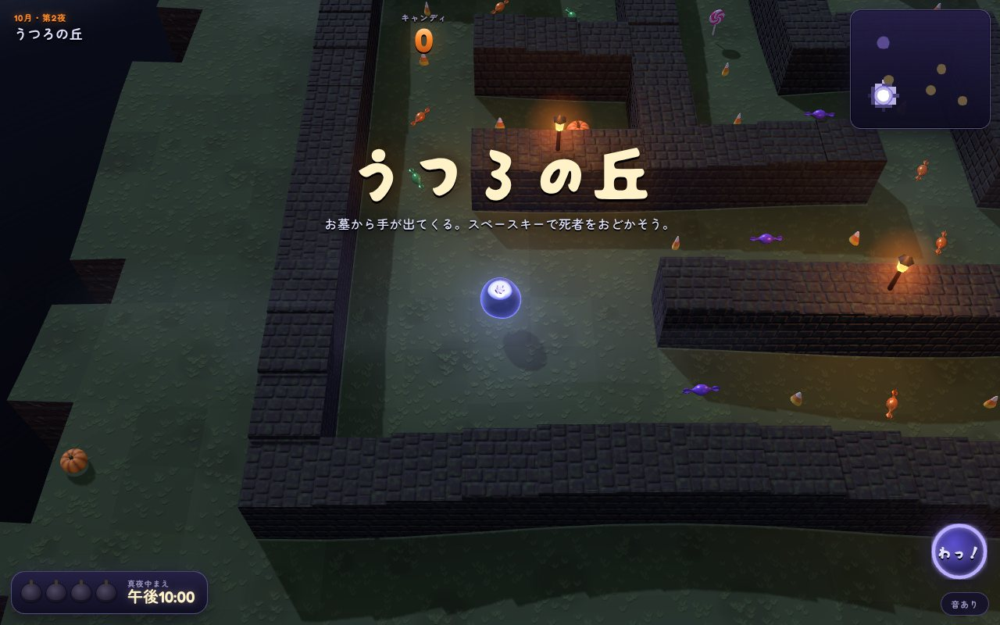
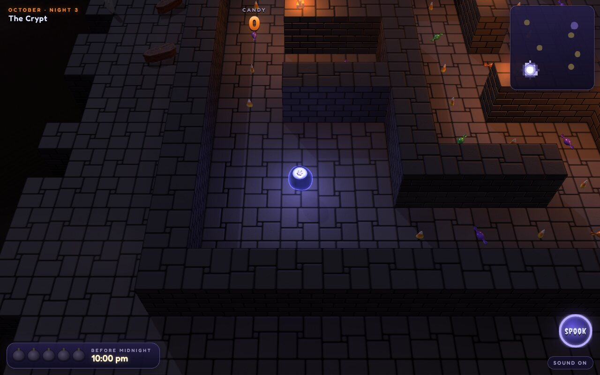
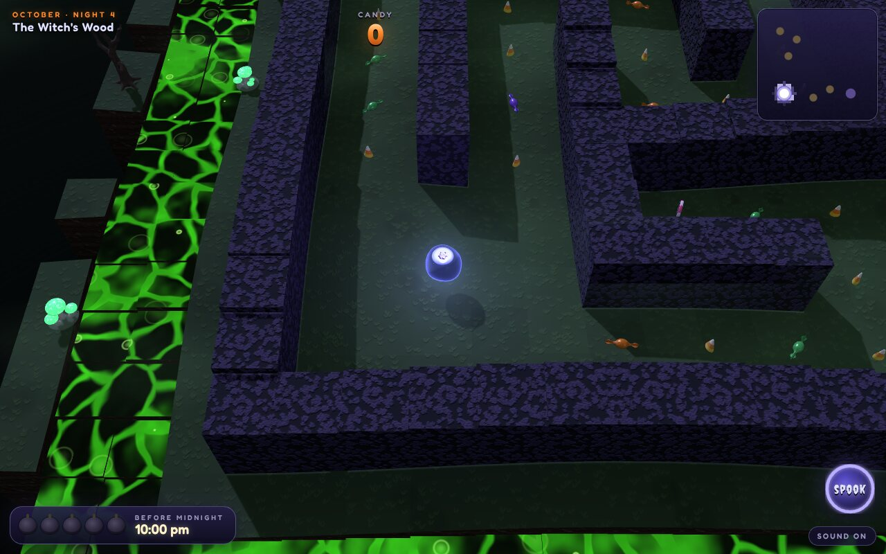
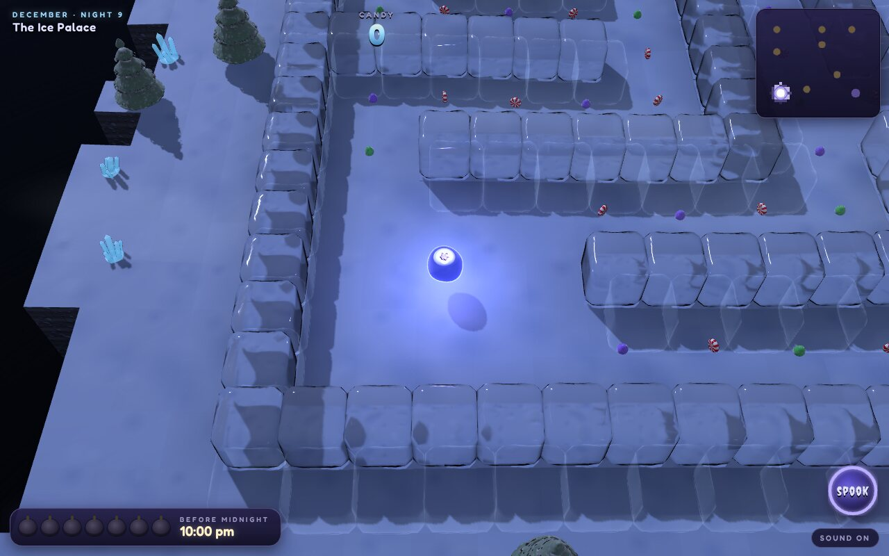

# Blubber

A haunted maze game. Blubber is a blueberry ghost, and it floats through ten
mazes from Halloween to midwinter: hedge mazes and graveyards in October, a
corn maze and a barnyard in November, and palaces of ice in December. In each
one it lights every lantern so the moon gate opens, eats what candy it can
find on the way, and spooks off whatever comes shambling after it.

Blubber is said /ˈbluːbər/ (BLOO-bər), like "blue" and "brr" run together,
so it rhymes with *blooper*. That suits it, because Blubber was a blooper. It
was supposed to be a plain blueberry, but it was made in the same chat as a
slime, straight after it, and it came out half slime: a squashy, glowing
ghost of a berry.

It's a casual game. There are no fights, and nothing can end a run. Getting
caught only makes Blubber spill some candy, and it can gather that up again
if it's quick.





## Run

```sh
git clone https://github.com/h1ddenpr0cess20/blubber
cd blubber
npm install
npm run dev               # → http://localhost:5173
```

It's a static page with no server and no keys. `npm run build` puts it in
`dist/`, which runs from any folder or path.

## Play

| | |
|---|---|
| <kbd>←</kbd><kbd>↑</kbd><kbd>↓</kbd><kbd>→</kbd> or <kbd>WASD</kbd> | Float. The maze is square on to the screen, so the keys push along its corridors. |
| Hold the mouse or a finger | Float toward the pointer. The further it is from Blubber, the harder the push. |
| <kbd>Space</kbd>, the spook button, or tap a second finger | Spook. Anything close turns and runs for a few seconds. It has to recharge between spooks. |
| <kbd>Q</kbd> <kbd>E</kbd>, or drag with the right mouse button | Turn the view. Dragging up and down tilts it. |
| Mouse wheel, or <kbd>+</kbd> <kbd>−</kbd> | Zoom. |
| Two fingers | Pinch to zoom, twist to turn, drag up or down to tilt. A second finger that's only tapped spooks instead, and the first keeps steering. |
| <kbd>C</kbd> | Put the view back. |
| <kbd>P</kbd> / <kbd>Esc</kbd> | Pause. |
| <kbd>M</kbd> | Sound on or off. |
| The button in the title's corner | English or Japanese. |
| Gamepad | Left stick or d-pad floats; <kbd>B</kbd> spooks; right stick turns and tilts; shoulder buttons zoom; <kbd>A</kbd> starts, <kbd>Start</kbd> pauses. |

### A night

- **Lanterns.** Every maze has some unlit lanterns tucked into its far dead
  ends: pumpkins in October, white pumpkins in November, heaps of
  snowballs in December. Float into one and it lights. The map in the
  corner shows where they all are. Once the last one is lit, the moon gate
  opens, and Blubber floats out through it.
- **Candy.** Trails of sweets run down every corridor, with bigger treats in
  the corners. The sweets change with the season: wrapped bonbons and candy
  corn, then caramel apples, then peppermints, gumdrops and candy canes.
- **Things in the way.** Each season has its own chaser: zombies in
  October, turkeys in November, snowmen in December. They wander until
  Blubber comes near, then follow it through the maze. There are also
  hands that reach up out of the graves, giant pumpkins, hay bales and
  snowballs that roll up and down the long halls, and bats and crows
  swooping overhead. Being caught knocks Blubber back and spills up to
  five sweets.
- **Spooking.** <kbd>Space</kbd> sends every chaser close by running for a
  few seconds and scatters the flyers. It can't be used again straight
  away.
- **Moons.** A night escaped is tallied in moons. The first is for getting
  out, the second for coming out with four fifths of the candy, and the
  third for getting out before the clock strikes midnight. The title keeps
  the best moons for each night, and any night reached so far can be
  started from there.

### The nights

| | | What's in it |
|---|---|---|
| **October** | 1. The Pumpkin Patch | A hedge maze, with pumpkins, hay and a scarecrow round it and one slow zombie. |
| | 2. Hollow Hill | Mossy graveyard walls, lamps, hands in the graves, zombies and a bat. |
| | 3. The Crypt | Brick halls lit by candles, coffins and bones, pumpkins rolling down the long halls. |
| | 4. The Witch's Wood | Bramble walls, a bog brewing round the edge and in a clearing, a cauldron, glowing toadstools. |
| **November** | 5. The Corn Maze | Corn as tall as the walls, corn shocks and scarecrows, turkeys and crows. |
| | 6. Gobbler's Barnyard | Plank walls, barrels, hay bales rolling, and more turkeys. |
| | 7. The Harvest Hall | A panelled hall lit by candles, the feast laid in the middle. |
| **December** | 8. Frostbite Hollow | Snowy hedges among the pines, snowmen, snowballs rolling. |
| | 9. The Ice Palace | Walls of ice blocks. |
| | 10. The Longest Night | The biggest maze, walled in ice, under the northern lights. |

### 日本語

The whole game is in Japanese as well: the title, the nights, the banners,
the clock and the tally. The button in the top corner of the title switches
between the two. It starts in whichever language was picked last, or else
the browser's own, and `?lang=ja` or `?lang=en` picks one outright.











## Blubber, and the ice

Blubber is the **Blueberry** avatar exactly as it was made: the squashed
berry with its calyx well, the waxy blue skin over a glowing juice core, the
five dried sepals of its crown, the rim bloom, the two halos and the palette
drifting through them. It also keeps its four moods with the same numbers,
and the game shows what Blubber is doing through them. It's idle when it
hangs still, listening as it floats along, speaking when it spooks, and
thinking (spinning, its colour racing) just after it has been caught. The
only changes are its size and the engine it's drawn on. `src/blubber.js` has
the details.

The winter walls are the **Ice Cube** avatar, also unchanged: its rounded
block, frozen-in facets, dished top, clear ice and frost rim, at rest on
every wall tile. (Its cloudy core and trapped bubbles are left out of the
walls: they're see-through, and the ice only shows what's solid behind
it, so they'd never be seen.) The whole drifting avatar
floats in the middle room of the last two nights. `src/ice.js` has the
details.

## How it's made

It runs on [Dungeon Roller](https://github.com/h1ddenpr0cess20/dungeon-roller)'s
engine. The renderer, the code-sculpting kit, the camera, the controls and
the way the levels are built as tiles with corner heights all come from
there. Everything else is new.

| | |
|---|---|
| `src/vendor/gfx/` | Alan's renderer, as Dungeon Roller has it. It uses WebGPU where the browser has it and WebGL 2 where it doesn't (`?renderer=webgl` pins it). |
| `src/blubber.js` | Blubber: the Blueberry avatar, ported to this engine. |
| `src/ice.js` | The Ice Cube avatar, ported, and the winter walls built of it. |
| `src/maze.js` | Grows a maze from a seed: a depth-first walk, some dead ends knocked through into loops, rooms opened up. `Plan` lays it out on the tiles. |
| `src/night.js` | Builds a night from its recipe: the maze, the rolling ground, and where everything goes. Lanterns go at far-apart dead ends, candy goes down every corridor, and the scenery goes round the outside. |
| `src/nights.js`, `src/themes.js` | The ten nights, and how each kind of night looks: colours, textures, walls, light, sky, scenery. |
| `src/grounds.js` | The tiles as meshes. The light is baked into the ground and baked again each time a lantern is lit, so the maze warms up as Blubber goes round it. |
| `src/float.js` | How Blubber floats: a hover over the ground on a spring, sliding along walls, drawn to the middle of a corridor. |
| `src/haunt.js` | One night's rules with nothing drawn. The game draws it and the tests play it. |
| `src/actors.js`, `src/decor.js` | Everything drawn that moves or can be taken, and the scenery, merged into a few meshes. |
| `src/models/` | Every creature, sweet, lantern and piece of scenery is sculpted in code from signed distance shapes. Each is baked into a mesh in a Web Worker as the page loads. Nothing is downloaded. |
| `src/textures.js` | Every surface is painted on a canvas at startup: hedges, grass, earth, flagstones, brick, fieldstone, corn, straw, planks, panelling, snow. |
| `src/stage.js` | The lights, the painted night sky, the ground mist. |
| `src/bog.js` | The witch's brew: Dungeon Roller's lava shader, cooled and turned green. |
| `src/lang.js` | Every word on screen, in English and in Japanese, and the switch between them. |
| `src/audio.js`, `src/score.js` | Every sound and the music, synthesised with Web Audio. The music is a dance track for each season, built round its tune: spooky electro with a theremin lead for October, a barn-dance stomp with a fiddle and banjo for November, and future bass with a music box and sleigh bells for December. Each one has an intro, a drop, a lift, a breakdown that builds to a snare roll, and a second, bigger drop. |

| Script | |
|---|---|
| `npm run dev` | Vite dev server. `/models.html?m=zombie,jack` is a turntable for the models. |
| `npm run build` | Bundles to `dist/` |
| `npm test` | `node:test`. Covers the mazes, the floating, the rules and every model. An autopilot plays every night: it has to light every lantern and get out, and also gather four fifths of the candy before midnight. |
| `npm run lint` | ESLint |
| `node scripts/map.js 3` | Prints a night as text. |
| `node scripts/bake.js` | Vertex counts and bake times for the models. |
| `node scripts/fonts.js …` | Cuts the Japanese fonts down to the characters the Japanese uses. Run it again after changing a Japanese word; the tests say when. |

The fonts are [Creepster](https://fonts.google.com/specimen/Creepster) and
[Fredoka](https://fonts.google.com/specimen/Fredoka), and for the Japanese
[Potta One](https://fonts.google.com/specimen/Potta+One) and
[Zen Maru Gothic](https://fonts.google.com/specimen/Zen+Maru+Gothic), all under
the SIL Open Font License (`src/fonts/`). The renderer's licence is in `src/vendor/gfx/LICENSE`.
